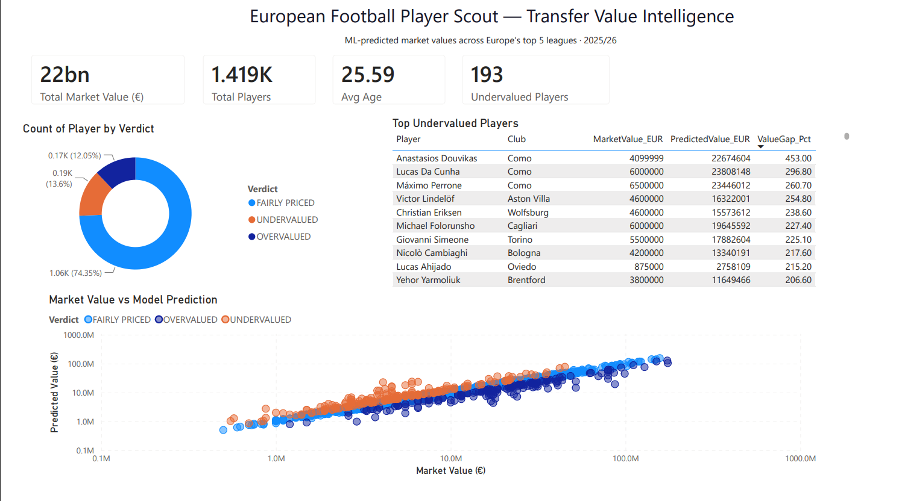

# ⚽ European Football Player Scout — Transfer Value Intelligence

> ML-powered player valuation and AI scouting across Europe's top 5 leagues.
> Predicts transfer market value from on-pitch performance, flags undervalued and overvalued players, and generates professional scouting reports with Claude AI.



---

## 📌 Overview

This project answers a real recruitment question: **is a player priced correctly relative to their performance?**

It builds an end-to-end pipeline that ingests player statistics for ~2,800 players across Europe's top 5 leagues, merges them with current market values, trains a machine learning model to predict value from performance, and uses an LLM to generate human-readable scouting verdicts (undervalued / fairly priced / overvalued). The results are presented in an interactive Power BI dashboard.

**Leagues covered:** Bundesliga · Premier League · La Liga · Serie A · Ligue 1 (2025/26 season)

---

## 🛠️ Tech Stack

| Layer | Technology |
|---|---|
| Data ingestion | Python · `soccerdata` (FBref) |
| Market values | FIFA / EA FC 26 dataset (Kaggle) |
| Record linkage | `rapidfuzz` · `unidecode` |
| ML model | XGBoost · scikit-learn |
| AI scouting reports | Anthropic Claude API |
| Dashboard | Power BI |
| Version control | Git · GitHub |

---

## ⚙️ Architecture

FBref player stats (soccerdata)          FIFA FC26 market values (Kaggle)

│                                         │

└─────────────┬───────────────────────────┘

▼

3-stage fuzzy matching pipeline

(team-aware → league-wide → global + age)

▼

Merged dataset (90% match rate)

▼

Feature engineering

(per-90 metrics, performance index,

age-value curve, contract urgency)

▼

XGBoost market value model

▼

┌─────────────┴─────────────┐

▼                           ▼

Claude AI scouting        Power BI dashboard

reports (EN/DE)           (value vs predicted,

undervalued players)

---

## 🔗 Data Pipeline & Record Linkage

The hardest engineering challenge was merging two independent data sources with no shared ID — FBref (performance) and FIFA (market value) — where player and club names differ ("Joshua Kimmich" vs "Joshua Walter Kimmich"; "Dortmund" vs "Borussia Dortmund").

A **three-stage fuzzy matching pipeline** was built:

1. **Team-restricted match** — match player names only within fuzzily-matched clubs (high precision)
2. **League-wide match** — strict name matching across the league for players whose club names didn't align
3. **Global + age-verified match** — search the entire FIFA dataset (all 43 leagues) for players who transferred out of the top 5, accepting matches only when age corroborates within ±1 year

This raised the match rate from **37% → 83% → 90%** (2,554 / 2,839 players). A key lesson: an early version used a season mismatch (2023/24 stats vs 2026 values), which transfers had invalidated — aligning both sources to the same season was critical.

---

## 🤖 The Model — and a Lesson in Target Leakage

Three model variants were trained and compared:

| Variant | Features | R² | MAE | Verdict |
|---|---|---|---|---|
| A | Performance only | 0.096 | €11.0M | Honest but underpowered |
| B | Performance + FIFA ratings | 0.974 | €1.1M | **Target leakage** ❌ |
| C | Performance + wage | **0.715** | **€6.2M** | **Primary model** ✅ |

**Variant B's near-perfect R² is a trap.** FIFA's `overall` rating is itself partly derived from market value, so including it just echoes the answer back — a textbook case of target leakage. It was rejected despite the headline number.

**Variant C** uses wage as an independent market signal (clubs negotiate wages separately from transfer value). Its top features are intuitive: `wage_eur`, `contract_urgent` (players in their final contract year lose value — a real transfer-market dynamic the model learned), and age. This is the honest, defensible model.

> **Known limitation:** the data source provided only standard/shooting stats — no passing or possession metrics. The model therefore undervalues deep playmakers (e.g. Bellingham) whose value comes from progression and control. This is documented rather than hidden, and the AI scouting layer is prompted to account for it.

---

## 📝 AI Scouting Reports

Each player's stats and predicted-vs-actual value gap are passed to Claude, which generates a ~250-word professional scouting report (English or German). Crucially, the model is prompted to acknowledge its own blind spots — for a flagged "overvalued" playmaker, it correctly notes the model may not capture creative quality.

See [`assets/sample_scouting_report.md`](assets/sample_scouting_report.md) for a full example.

---

## 📊 Dashboard

The Power BI dashboard (above) features:
- **KPI cards** — total players, market value, average age, undervalued count
- **Verdict breakdown** — proportion of under/over/fairly-priced players
- **Top undervalued players** — sorted by value gap
- **Value vs prediction scatter** (log-scaled) — the visual heart of the project, with undervalued players above the diagonal and overvalued below
- **League slicer** — interactive filtering across all visuals

---

## 📁 Project Structure

bundesliga-player-scout/

├── app/

│   ├── data_pipeline.py        # FBref stats ingestion (5 leagues)

│   ├── merge_data.py            # 3-stage fuzzy matching → market values

│   ├── feature_engineering.py   # per-90 metrics, performance index, etc.

│   ├── model.py                 # XGBoost training, 3-variant comparison

│   ├── llm_engine.py            # Claude scouting reports

│   └── export_for_powerbi.py    # clean dataset export for dashboard

├── models/                      # trained model + feature importance charts

├── assets/                      # dashboard screenshot, sample report

├── requirements.txt

└── README.md

---

## 🚀 Setup

```bash
# Clone and enter
git clone https://github.com/MuhammadAli-99/bundesliga-player-scout.git
cd bundesliga-player-scout

# Virtual environment
python -m venv venv
venv\Scripts\activate        # Windows

# Dependencies
pip install -r requirements.txt

# Add your Anthropic API key
echo ANTHROPIC_API_KEY=your-key-here > .env

# Run the pipeline
python -m app.data_pipeline
python -m app.merge_data
python -m app.feature_engineering
python -m app.model
python -m app.export_for_powerbi
```

---

## 💡 Key Skills Demonstrated

- **Record linkage** across messy real-world data sources (fuzzy matching, multi-signal verification)
- **ML modeling judgment** — identifying and rejecting target leakage rather than chasing inflated metrics
- **Feature engineering** — domain-specific football metrics (per-90, performance index, contract urgency)
- **LLM integration** — structured prompting with awareness of model limitations
- **Business intelligence** — interactive Power BI dashboard for non-technical stakeholders
- **Honest analysis** — documenting limitations (GK exclusion, missing passing data) transparently

---

## 📬 Contact

**Muhammad Ali** · Data Analytics, TU Ilmenau
[GitHub](https://github.com/MuhammadAli-99)